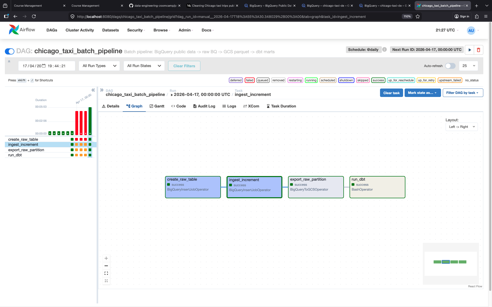
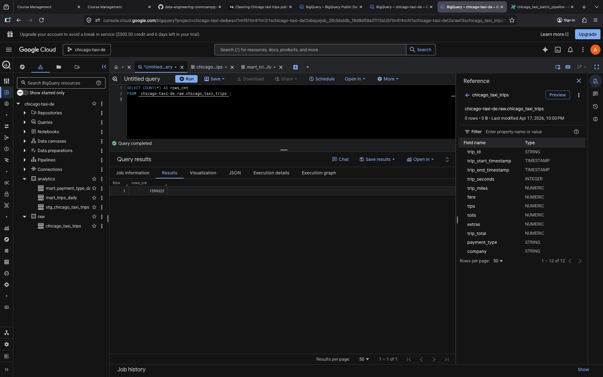
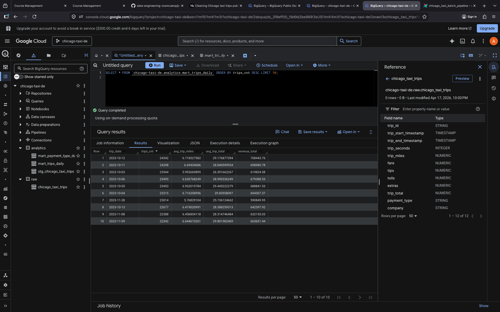
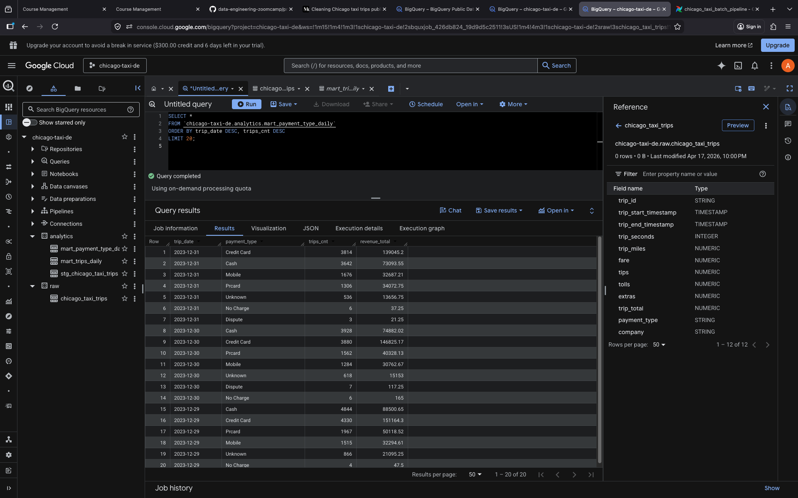
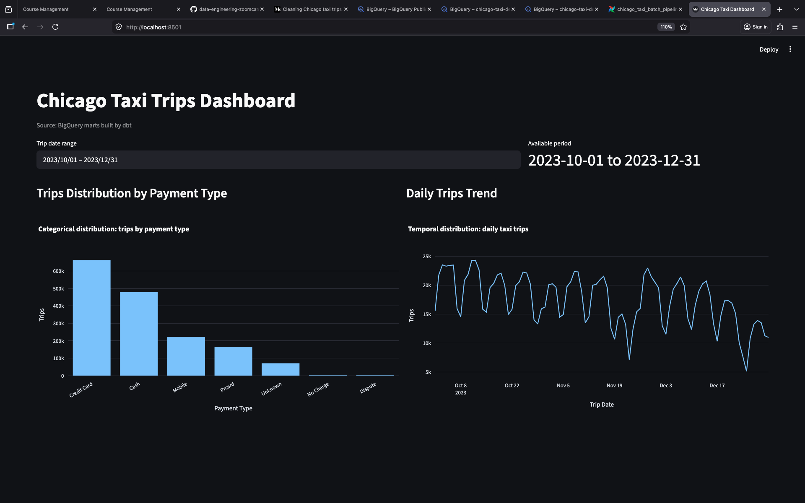

# Chicago Taxi Trips Analytics Pipeline

An end-to-end batch data engineering project built around the public Chicago Taxi Trips dataset in BigQuery.

## Problem Statement

This project analyzes taxi activity in Chicago and answers two business questions:

1. How does taxi demand change over time?
2. How are trips distributed across payment types?

The final dashboard is designed to satisfy the course requirement of at least two tiles:

- **Categorical distribution:** trips by `payment_type`
- **Temporal distribution:** daily trips trend

## Project Overview

The pipeline reads data from a public BigQuery dataset, ingests selected partitions into the project's own cloud resources, stores raw snapshots in a data lake, transforms the data with dbt, and exposes analytics-ready marts for dashboarding.

## Data Source

This project uses the public **Chicago Taxi Trips** dataset hosted in **Google BigQuery Public Data**.

https://console.cloud.google.com/bigquery?project=bigquery-public-data&d=chicago_taxi_trips&t=taxi_trips&p=bigquery-public-data&page=table
- **Public source table:** `bigquery-public-data.chicago_taxi_trips.taxi_trips` 
- **Source platform documentation:** https://cloud.google.com/bigquery/public-data
- **Dataset catalog:** https://cloud.google.com/datasets

### Why this dataset

This dataset is a good fit for the course project because it includes:

- temporal fields such as `trip_start_timestamp` and `trip_end_timestamp`
- categorical fields such as `payment_type` and `company`
- enough volume to justify partitioning and clustering in BigQuery

### Important storage note

The original source dataset is **not stored in this repository**.

The pipeline reads the public BigQuery table directly and only persists the required subset into the project's own cloud resources:

- **BigQuery raw dataset** for ingested source rows
- **Google Cloud Storage** for Parquet snapshots
- **BigQuery analytics dataset** for transformed marts

## Do I Need the Dataset Locally?

**No.** A local copy is not required for the production pipeline.

The production flow is:

1. Read from `bigquery-public-data.chicago_taxi_trips.taxi_trips`
2. Load the selected daily slice into `<your_project_id>.raw.chicago_taxi_trips`
3. Export the same partition to `gs://<your-bucket>/raw/chicago_taxi_trips/...`
4. Build mart tables in `<your_project_id>.analytics`

A local sample is only optional for quick debugging or experimentation.

## Architecture

1. **Source**
   - `bigquery-public-data.chicago_taxi_trips.taxi_trips`
2. **Orchestration**
   - Airflow DAG in `airflow/dags/chicago_taxi_batch_pipeline.py`
3. **Raw warehouse layer**
   - `<your_project_id>.raw.chicago_taxi_trips`
4. **Data lake**
   - `gs://<your-bucket>/raw/chicago_taxi_trips/date=YYYY-MM-DD/`
5. **Transformations**
   - dbt models in `dbt/models/`
6. **Analytics layer**
   - `<your_project_id>.analytics.mart_trips_daily`
   - `<your_project_id>.analytics.mart_payment_type_daily`
7. **Dashboard**
   - Looker Studio or Streamlit over analytics marts

## Repository Layout

- `airflow/dags/` - orchestration DAGs
- `airflow/variables.example.json` - example Airflow variables
- `dbt/` - dbt project, models, and profiles
- `infra/terraform/` - Terraform code for GCS and BigQuery datasets
- `src/pipeline/` - Python SQL builder utilities
- `scripts/` - local helper scripts
- `dashboard/` - Streamlit dashboard app and notes
- `tests/` - unit tests
- `docker-compose.yml` - local Airflow + Postgres stack
- `.env.example` - example runtime configuration

## Tech Stack

- **Cloud:** Google Cloud Platform
- **Infrastructure as Code:** Terraform
- **Orchestration:** Apache Airflow
- **Data Lake:** Google Cloud Storage
- **Data Warehouse:** BigQuery
- **Transformations:** dbt (`dbt-bigquery`)
- **Dashboard:** Streamlit (local run)

## Warehouse Design

### Raw layer

The raw table is created as:

- **Partitioned by:** `DATE(trip_start_timestamp)`
- **Clustered by:** `payment_type`, `company`

This matches the expected access pattern of time filtering and categorical grouping used in the dashboard.

### Analytics layer

The dbt models build:

- `mart_trips_daily`
- `mart_payment_type_daily`

These marts reduce repeated full scans of the raw source and are shaped for dashboard queries.

## Prerequisites

Before running the project, make sure you have:

- Python 3.10+
- Docker and Docker Compose
- Terraform 1.5+
- Google Cloud CLI (`gcloud`) authenticated for your project
- a GCP project with BigQuery and Cloud Storage enabled
- Google Cloud credentials with permissions to create BigQuery datasets, tables, and GCS buckets

## Placeholder Legend

This README keeps infrastructure values generic so a reviewer can run the project in their own GCP environment.

- Replace `<your_project_id>` with your own Google Cloud project id
- Replace `<your-bucket>` with your own GCS bucket name
- The dataset names `raw` and `analytics` are the defaults used in this repository; if you change them in `.env` or Terraform, update the SQL examples accordingly
- The concrete demo values shown later in the screenshot evidence section are from my own run and are included only to explain the attached screenshots

## Quickstart (Reviewer-Friendly)

Use this section if you want to run the project from scratch as quickly as possible.

### 1) Copy credentials into the project

If you already authenticated with Application Default Credentials (`gcloud auth application-default login`), copy the generated file:

```bash
cp ~/.config/gcloud/application_default_credentials.json ./credentials/google_credentials.json
ls -la ./credentials/
```

### 2) Install Terraform (macOS)

```bash
brew tap hashicorp/tap
brew install hashicorp/tap/terraform
terraform version
```

### 3) Create local config files

```bash
cp .env.example .env
cp infra/terraform/terraform.tfvars.example infra/terraform/terraform.tfvars
```

Update these values in `.env`:

- `GCP_PROJECT_ID`
- `LAKE_BUCKET`
- `DBT_BIGQUERY_PROJECT`

Update these values in `infra/terraform/terraform.tfvars`:

- `project_id`
- `gcs_bucket_name`

### 4) Provision infrastructure

```bash
terraform -chdir=infra/terraform init
terraform -chdir=infra/terraform apply
```

When prompted, type `yes`.

### 5) Start Airflow and create required GCP connection

```bash
docker compose up -d
docker compose exec airflow-scheduler airflow connections add google_cloud_default \
  --conn-type google_cloud_platform \
  --conn-extra '{"extra__google_cloud_platform__project":"<your_project_id>"}'
```

This connection is required by `BigQueryInsertJobOperator` and `BigQueryToGCSOperator`.

### 6) Trigger a historical DAG run (recommended)

The source table can have sparse or missing data for some recent dates. Use a known date with data, for example:

```bash
docker compose exec airflow-scheduler airflow dags trigger chicago_taxi_batch_pipeline \
  --exec-date 2023-12-29T00:00:00+00:00
```

Then wait until all four tasks are green.

## Configuration

### 1) Environment file

Copy the example file and fill in your real values:

```bash
cp .env.example .env
```

Important variables:

- `GCP_PROJECT_ID` - your GCP project id
- `LAKE_BUCKET` - bucket for Parquet snapshots
- `RAW_DATASET` - raw BigQuery dataset name
- `ANALYTICS_DATASET` - analytics BigQuery dataset name
- `DBT_BIGQUERY_PROJECT` - project used by dbt
- `GOOGLE_APPLICATION_CREDENTIALS` - credentials path inside the Airflow containers
- `AIRFLOW_ADMIN_USERNAME` / `AIRFLOW_ADMIN_PASSWORD` - local Airflow login

### 2) Credentials

Place your Google service account credentials file at:

- `credentials/google_credentials.json`

The local Airflow containers mount the `credentials/` directory and use:

- `/opt/airflow/credentials/google_credentials.json`

If you prefer another filename or path, update `GOOGLE_APPLICATION_CREDENTIALS` in `.env` accordingly.

If you use Application Default Credentials locally, a common flow is:

```bash
cp ~/.config/gcloud/application_default_credentials.json ./credentials/google_credentials.json
ls -la ./credentials/
```

### 3) Terraform variables

Copy the Terraform example file:

```bash
cp infra/terraform/terraform.tfvars.example infra/terraform/terraform.tfvars
```

Fill in the following values:

- `project_id`
- `region`
- `gcs_bucket_name`
- `raw_dataset`
- `analytics_dataset`

### 4) dbt profile

A ready-to-use dbt profile that reads values from environment variables is included in the repository:

- `dbt/profiles.yml`

For manual local dbt runs, point dbt to this profiles directory.

## Infrastructure Setup

Create cloud resources:

```bash
terraform -chdir=infra/terraform init
terraform -chdir=infra/terraform apply
```

This creates:

- a GCS bucket for the data lake
- a BigQuery `raw` dataset
- a BigQuery `analytics` dataset

## Local Validation

Install local test dependencies and run the smoke checks:

```bash
python -m pip install -r requirements.txt
pytest -q
```

Optional SQL preview:

```bash
GCP_PROJECT_ID=demo-project DBT_BIGQUERY_PROJECT=demo-project python scripts/preview_queries.py
```

## Running Airflow Locally

Start the local services:

```bash
docker compose up -d
```

This starts:

- `postgres`
- `airflow-webserver`
- `airflow-scheduler`

Airflow UI:

- `http://localhost:8080`

Default local login values are taken from `.env`:

- username: `admin`
- password: `admin`

### Required Airflow GCP connection

Create this once after `docker compose up -d`:

```bash
docker compose exec airflow-scheduler airflow connections add google_cloud_default \
  --conn-type google_cloud_platform \
  --conn-extra '{"extra__google_cloud_platform__project":"<your_project_id>"}'
```

Without it, the DAG fails with: `The conn_id 'google_cloud_default' isn't defined`.

### How Airflow gets its configuration

The local stack uses `.env` and automatically maps these values into Airflow Variables:

- `GCP_PROJECT_ID` -> `gcp_project_id`
- `RAW_DATASET` -> `raw_dataset`
- `LAKE_BUCKET` -> `lake_bucket`

Example values are also included in `airflow/variables.example.json`.

## Airflow Pipeline

Main DAG:

- `chicago_taxi_batch_pipeline`

Tasks:

1. `create_raw_table`
   - creates the raw BigQuery table if it does not already exist
2. `ingest_increment`
   - reads one day of data from the public source table
   - inserts that slice into `<your_project_id>.raw.chicago_taxi_trips`
3. `export_raw_partition`
   - exports the corresponding raw partition to GCS as Parquet
4. `run_dbt`
   - runs dbt against the models in `dbt/`

To run the pipeline locally:

1. Open Airflow
2. Unpause `chicago_taxi_batch_pipeline`
3. Trigger a manual run (prefer a historical `execution_date` with known data, e.g. `2023-12-29`)
4. Wait for all tasks to succeed

CLI trigger example:

```bash
docker compose exec airflow-scheduler airflow dags trigger chicago_taxi_batch_pipeline \
  --exec-date 2023-12-29T00:00:00+00:00
```

## Running dbt Manually

The Airflow DAG runs dbt as the last step, but you can also execute dbt manually.

```bash
cd dbt
dbt build --profiles-dir . --target prod
```

## Running Dashboard (Streamlit)

The repository includes a Streamlit dashboard app in `dashboard/app.py`.

```bash
python -m pip install -r requirements.txt
PYTHONPATH=src GCP_PROJECT_ID=<your_project_id> ANALYTICS_DATASET=analytics python -m streamlit run dashboard/app.py
```

The dashboard includes:

- a categorical tile: **Trips Distribution by Payment Type**
- a temporal tile: **Daily Trips Trend**
- a shared `trip_date` range filter

## dbt Models

### Staging

- `stg_chicago_taxi_trips`
  - typed and cleaned staging layer
  - derives `trip_date`
  - normalizes empty categorical values

### Marts

- `mart_trips_daily`
  - daily trip counts
  - average trip miles
  - average trip total
  - total revenue

- `mart_payment_type_daily`
  - daily trip counts by payment type
  - daily revenue by payment type

## Dashboard Specification

The minimum dashboard includes two required tiles.

### Tile 1 - Trips by Payment Type

- **Source table:** `analytics.mart_payment_type_daily`
- **Metric:** `SUM(trips_cnt)`
- **Dimension:** `payment_type`
- **Suggested chart:** bar chart or pie chart

### Tile 2 - Daily Trips Trend

- **Source table:** `analytics.mart_trips_daily`
- **Metric:** `trips_cnt`
- **Dimension:** `trip_date`
- **Suggested chart:** line chart

## How to Verify That the Pipeline Worked

After running the DAG, verify these artifacts.

### 1) Public source is reachable

In BigQuery, confirm that you can access:

- `bigquery-public-data.chicago_taxi_trips.taxi_trips`

### 2) Raw table exists

Check:

- `<your_project_id>.raw.chicago_taxi_trips`

### 3) Analytics tables exist

Check:

- `<your_project_id>.analytics.mart_trips_daily`
- `<your_project_id>.analytics.mart_payment_type_daily`

### 4) Lake files exist

In Cloud Storage, confirm a path like:

- `gs://<your-bucket>/raw/chicago_taxi_trips/date=YYYY-MM-DD/`

### 5) DAG completed successfully

In Airflow UI, make sure these tasks are green:

- `create_raw_table`
- `ingest_increment`
- `export_raw_partition`
- `run_dbt`

## Example Verification Queries

### Raw row count

```sql
SELECT COUNT(*) AS rows_cnt
FROM `<your_project_id>.raw.chicago_taxi_trips`;
```

### Available date range

```sql
SELECT
  MIN(DATE(trip_start_timestamp)) AS min_date,
  MAX(DATE(trip_start_timestamp)) AS max_date
FROM `<your_project_id>.raw.chicago_taxi_trips`;
```

### Daily mart preview

```sql
SELECT *
FROM `<your_project_id>.analytics.mart_trips_daily`
ORDER BY trip_date DESC
LIMIT 10;
```

### Payment distribution mart preview

```sql
SELECT *
FROM `<your_project_id>.analytics.mart_payment_type_daily`
ORDER BY trip_date DESC, trips_cnt DESC
LIMIT 20;
```

## Troubleshooting

### `rows_cnt = 0` in raw table

Your DAG may have run for a date with no source data. Trigger with a historical date known to have data (for example `2023-12-29`):

```bash
docker compose exec airflow-scheduler airflow dags trigger chicago_taxi_batch_pipeline \
  --exec-date 2023-12-29T00:00:00+00:00
```

### Analytics tables exist but are empty

If `raw.chicago_taxi_trips` has rows but marts are empty, run dbt with full refresh:

```bash
docker compose exec airflow-scheduler \
  bash -c "cd /opt/airflow/dbt && dbt build --profiles-dir /opt/airflow/dbt --target prod --full-refresh"
```

### Airflow error: missing `google_cloud_default`

Create the required connection:

```bash
docker compose exec airflow-scheduler airflow connections add google_cloud_default \
  --conn-type google_cloud_platform \
  --conn-extra '{"extra__google_cloud_platform__project":"<your_project_id>"}'
```

## Testing

Local unit tests live in `tests/test_sql.py` and validate the generated SQL structure.

```bash
pytest -q
```

## Notes for Reviewers

- The source data is public and is **not committed to this repository**
- The production pipeline reads directly from BigQuery Public Data
- Terraform manages the project infrastructure
- Airflow orchestrates ingestion and dbt execution
- The local Airflow stack auto-populates the required Airflow Variables from `.env`
- In my demo environment, I ingested only selected historical partitions from late 2023 (for example, October-December 2023). This is expected because the `ingest_increment` task loads one `execution_date` partition per DAG run.
- Replace placeholder values such as `<your_project_id>` and `<your-bucket>` with your own resources before running commands
- The project id `chicago-taxi-de` and bucket `chicago-taxi-de-lake` below are demo values from my screenshots, not required reviewer values

## Reviewer Evidence Checklist

### Demo values used in my screenshots

- `project_id`: `chicago-taxi-de`
- `raw dataset`: `raw`
- `analytics dataset`: `analytics`
- `bucket`: `chicago-taxi-de-lake`

Use your own project and bucket when running the project locally.

### Airflow DAG — all 4 tasks success



> How to get: Airflow UI → DAG `chicago_taxi_batch_pipeline` → Graph tab → screenshot when all boxes are green.

---

### BigQuery — raw table row count



> How to get in your own environment: BigQuery Console → run the query below and capture the results tab screenshot.

```sql
SELECT COUNT(*) AS rows_cnt
FROM `<your_project_id>.raw.chicago_taxi_trips`;
```

> In my attached screenshot, the demo project id is `chicago-taxi-de`.

---

### BigQuery — mart_trips_daily preview



> How to get in your own environment: BigQuery Console → run the query below and capture the results tab screenshot.

```sql
SELECT *
FROM `<your_project_id>.analytics.mart_trips_daily`
ORDER BY trip_date DESC
LIMIT 10;
```

> In my attached screenshot, the demo project id is `chicago-taxi-de`.

---

### BigQuery — mart_payment_type_daily preview



> How to get in your own environment: BigQuery Console → run the query below and capture the results tab screenshot.

```sql
SELECT *
FROM `<your_project_id>.analytics.mart_payment_type_daily`
ORDER BY trips_cnt DESC
LIMIT 10;
```

> In my attached screenshot, the demo project id is `chicago-taxi-de`.

---

### Dashboard — 2 tiles



> Dashboard is reproducible locally using instructions in `dashboard/README.md`.

Reviewer local run:

```bash
cd /Users/andrii.levchenko/PycharmProjects/data-engineering
PYTHONPATH=src GCP_PROJECT_ID=<your_project_id> ANALYTICS_DATASET=analytics .venv/bin/python -m streamlit run dashboard/app.py
```